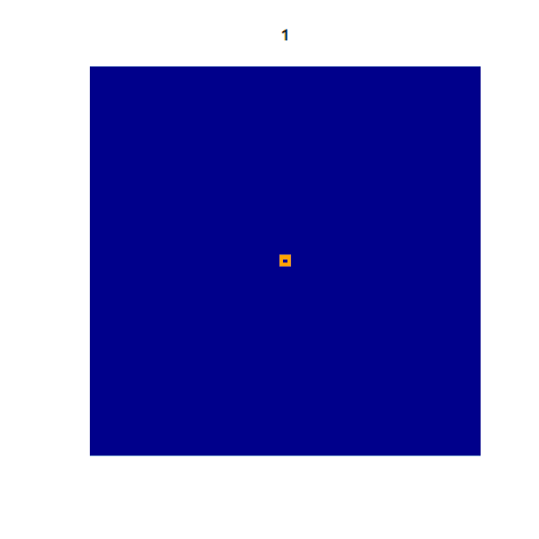

### How it starts
A matrix of cells is initialized, with the user choosing
which cells should be set to active at the start of the program.

### Active Condition
For each cycle/step, the script will check each cell in
the matrix, and set it to active if it has an odd number of 
active neighbouring cells. 
If a given cell does not meet this
condition, the cell is set to (or remains) inactive. 

### The Outcome
This basic set of rules can produce some rather interesting patterns over
time, and can differ greatly basic on small changes to the initial
active cells.

Below is an examle of the first 50 cycles of a 101x101 matrix of cells,
in which the initial active cells form a square around the very middle
of the matrix.

##### Note: 
This script is heavily inspired by John Conway's game of life,
which can be found at https://playgameoflife.com/
